# ThinkPad-Y7000-hackintosh
### 电脑配置：

|项目|信息|
|:-----:|-----|
|操作系统|Mojave 10.14(18A391)/High Sierra 10.13.6(17G2112)|
|CPU信息|Intel(R) Core(TM) i7-8750H CPU @ 2.20GHz|
|主板芯片组|Intel Cannon Lake HM370|
||Intel Coffee Lake-H|
|内存信息|8192MB  (DDR4 SDRAM)|
|显卡信息|NVIDIA GeForce GTX 1060 6GB(已禁用)|
||Intel(R) UHD Graphics 630(platform-id:3e9b0000)|
|硬盘信息|RPFTJ128PDD2EWX (128GB)|
||ST2000LM007-1R8174 (2TB)|
|网卡信息|Qualcomm Atheros QCA9377 (未驱动)|
||Realtek PCIe GbE Family Controller(Realtek8111.kext)|
|声卡信息|Realtek ALC236 @ AppleALC layout-id:3|
||Intel Kaby Lake HDMI @ 未测试|

## 安装镜像

直接使用博客中的镜像进行安装：[【黑果小兵】macOS Mojave 10.14(18A389) with Clover 4670原版镜像](https://blog.daliansky.net/macOS-Mojave-10.14-18A389-Release-with-Clover-4670-original-mirror.html)

支持8代显卡直接亮屏安装/使用

## 完善驱动

1. 声卡：型号为ALC236，注入ID：3，使用AppleALC仿冒，顺利加载；
2. 网卡：Qualcomm Atheros QCA9377 (未驱动)未替换其它可用无线网卡；
3. 显卡：Intel(R) UHD Graphics 630，Platform-id为：0x3e9b0000，添加DVMT补丁；采用Devices-Properties方法注入；未驱动Nvidia GeForce GTX 1060，无扩展显示接口；
4. 蓝牙工作正常；睡眠唤醒工作正常；
5. 电池信息正常；
6. 触摸板正常工作；
7. USB端口采用SSDT-UIAC.aml进行修改；摄像头、读卡器已内建，避免睡眠问题；

### 截屏

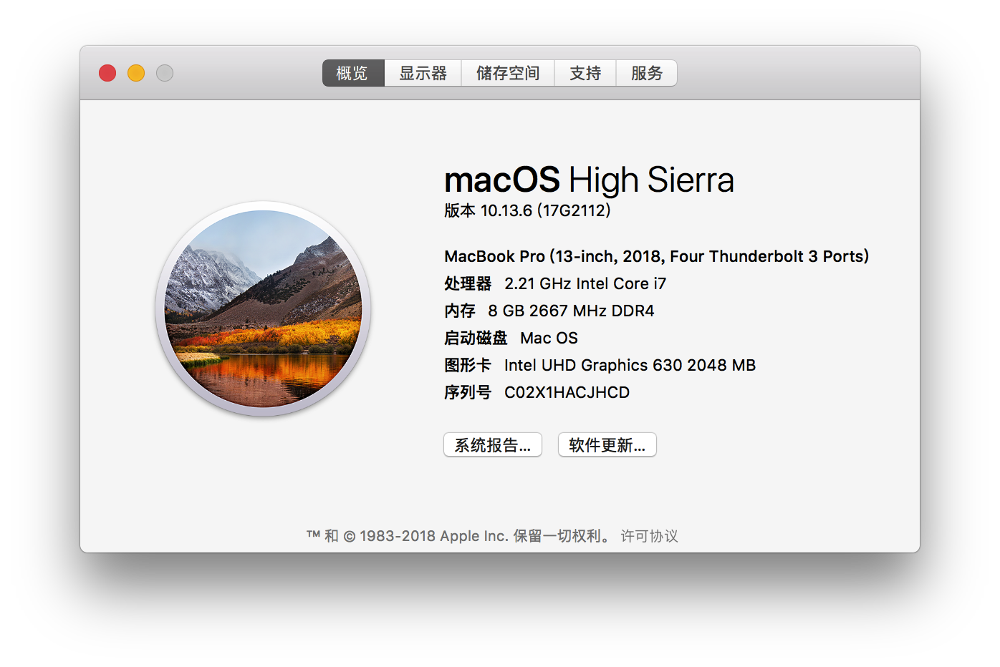

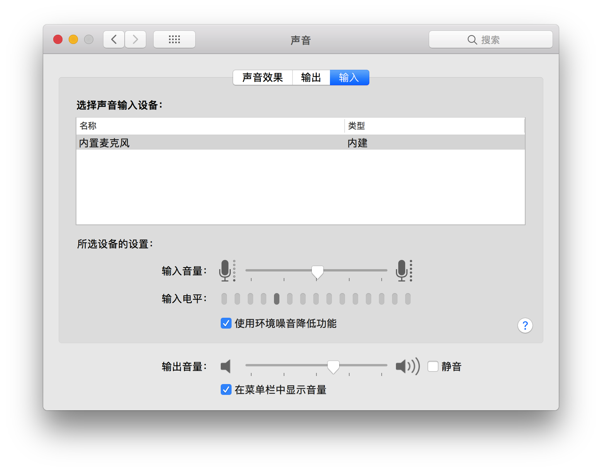

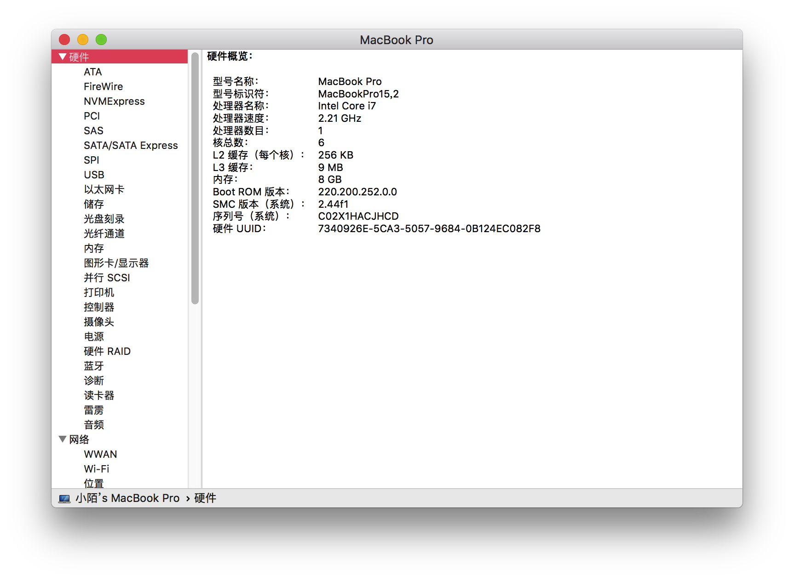

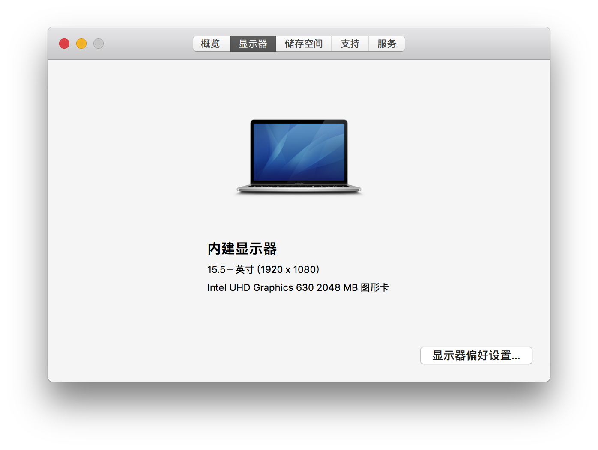

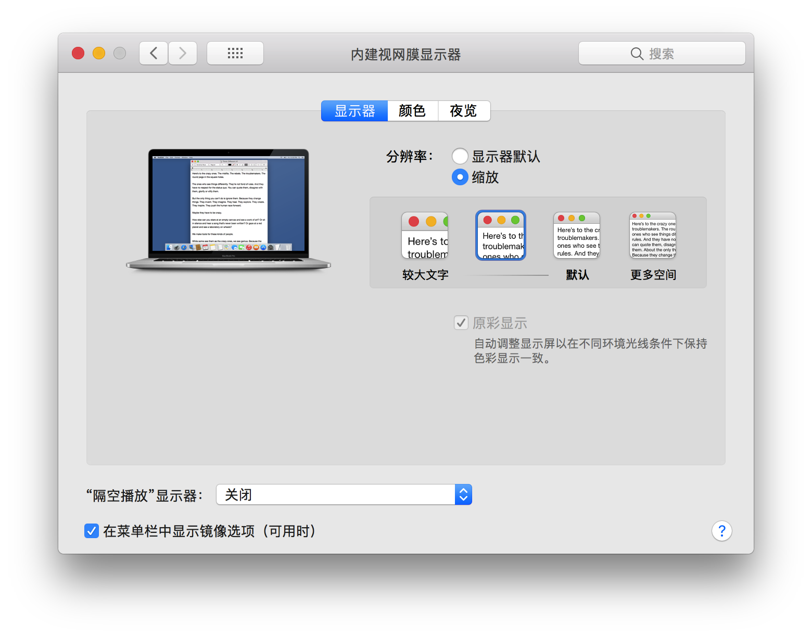

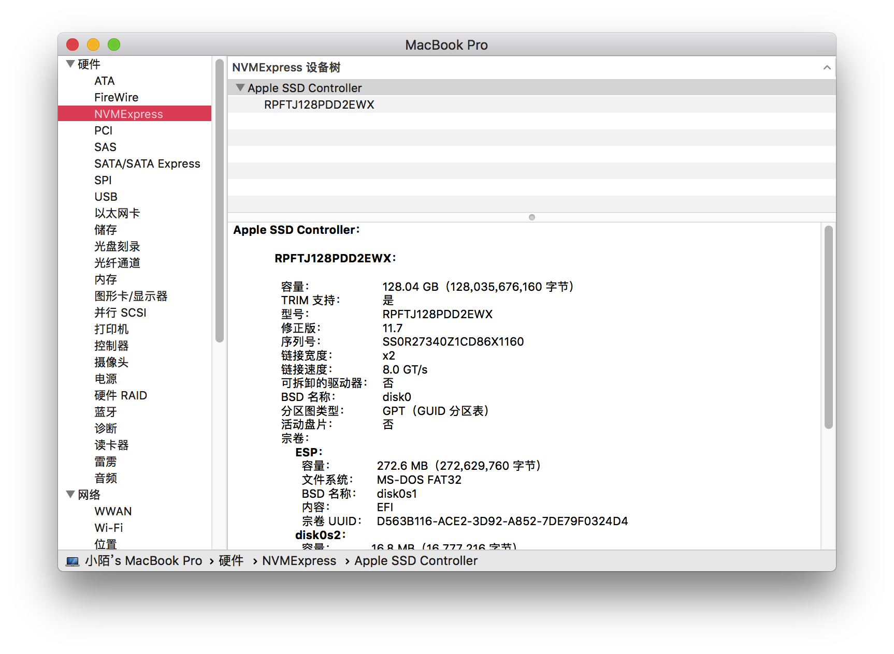

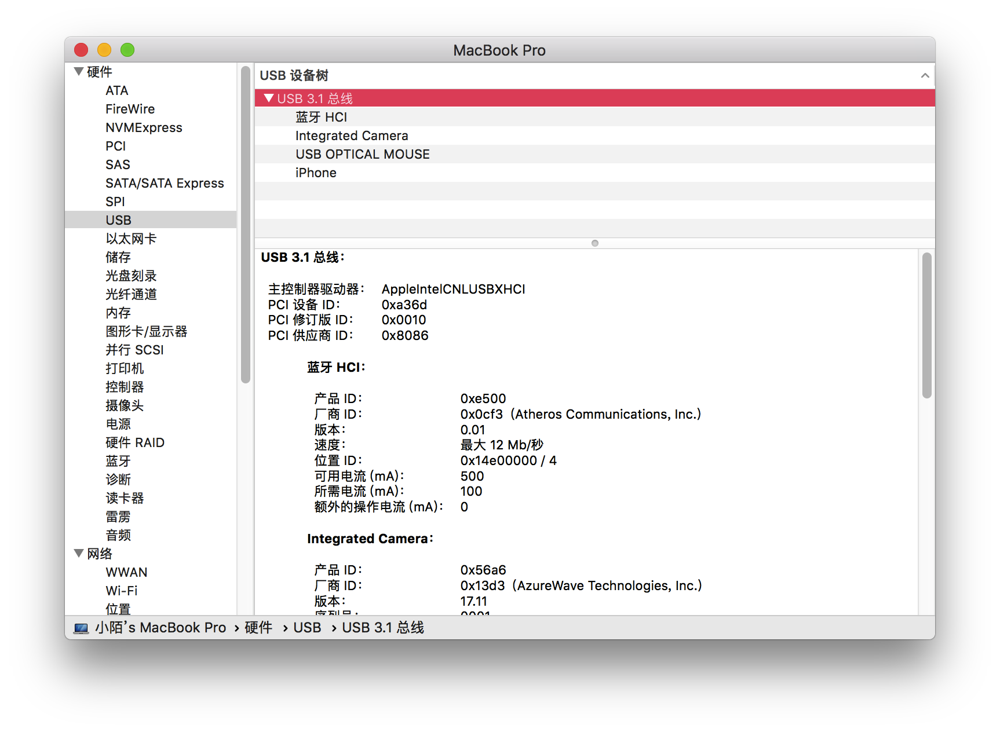

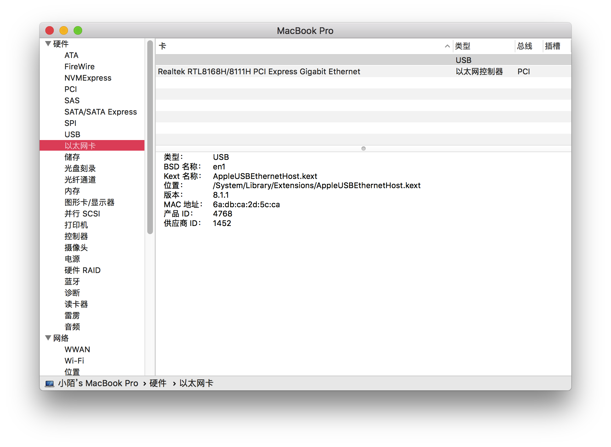

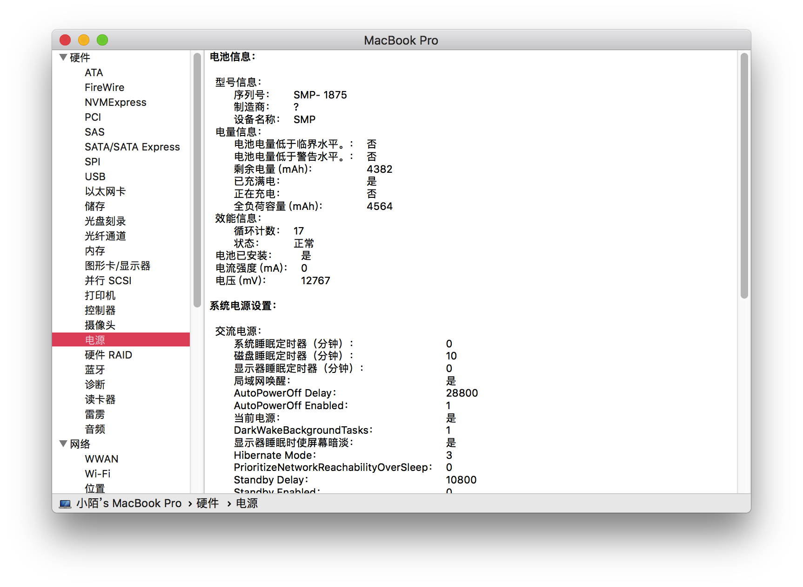

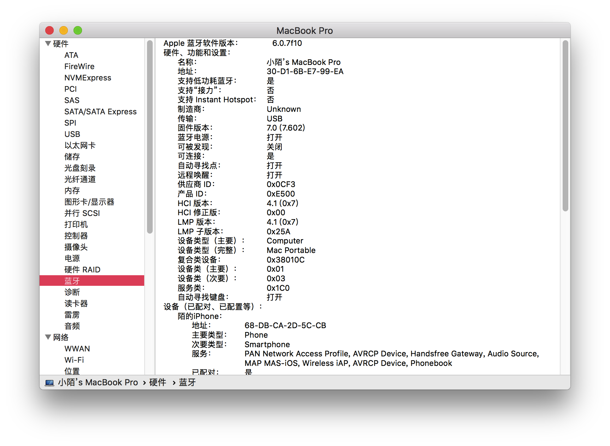

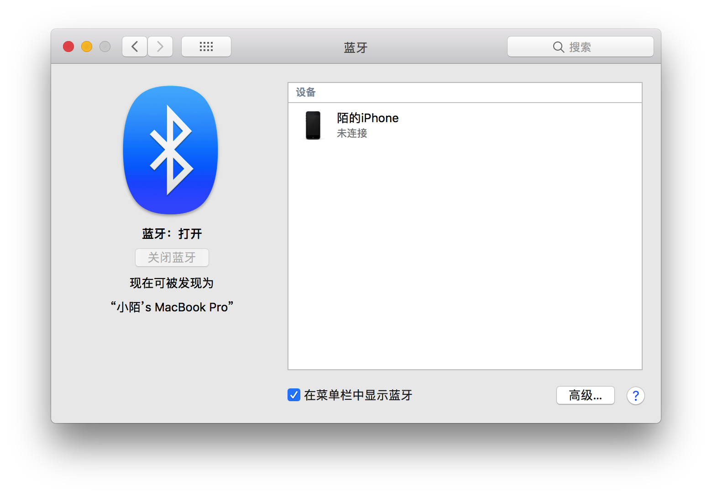

### EFI更新日志

- 10-29-2018

  - 项目建立

- 10-30-2018

  - 添加电池修复补丁

  

## EFI更新源

[https://github.com/daliansky/Lenovo-Y7000-hackintosh](https://github.com/daliansky/Lenovo-Y7000-hackintosh)

## 特别鸣谢：@宪武，整理出联想所有机型的hotpatch

## 鸣谢：

- [RehabMan](https://github.com/RehabMan) 提供 [AppleBacklightInjector](https://github.com/RehabMan/HP-ProBook-4x30s-DSDT-Patch/tree/master/kexts/AppleBacklightInjector.kext) 和 [EAPD-Codec-Commander](https://github.com/RehabMan/EAPD-Codec-Commander) 和 [OS-X-ACPI-Battery-Driver](https://github.com/RehabMan/OS-X-ACPI-Battery-Driver) 和 [OS-X-Clover-Laptop-Config](https://github.com/RehabMan/OS-X-Clover-Laptop-Config) 和 [OS-X-FakeSMC-kozlek](https://github.com/RehabMan/OS-X-FakeSMC-kozlek) 和 [OS-X-Null-Ethernet](https://github.com/RehabMan/OS-X-Null-Ethernet) 和 [OS-X-USB-Inject-All](https://github.com/RehabMan/OS-X-USB-Inject-All) 和 [OS-X-Voodoo-PS2-Controller](https://github.com/RehabMan/OS-X-Voodoo-PS2-Controller) 的维护
- [vit9696](https://github.com/vit9696) 提供 [Lilu](https://github.com/acidanthera/Lilu) 和 [AppleALC](https://github.com/acidanthera/AppleALC) 和 [WhateverGreen](https://github.com/acidanthera/WhateverGreen) 的维护
- [PMheart](https://github.com/PMheart) 提供 [CPUFriend](https://github.com/PMheart/CPUFriend) 的维护
- [alexandred](https://github.com/alexandred) 和 [hieplpvip](https://github.com/hieplpvip) 提供 [VoodooI2C](https://github.com/alexandred/VoodooI2C) 的维护
- [PavelLJ](https://github.com/PavelLJ) 和 [Javmain](https://github.com/javmain) 和 [johnnync13](https://github.com/johnnync13) 的宝贵建议

## 关于打赏

如果您认可我的工作，请通过打赏支持我后续的更新

| 微信                                                       | 支付宝                                               |
| ---------------------------------------------------------- | ---------------------------------------------------- |
|  |  |

## QQ群:

688324116[一起黑苹果](https://shang.qq.com/wpa/qunwpa?idkey=6bf69a6f4b983dce94ab42e439f02195dfd19a1601522c10ad41f4df97e0da82)

128630866[ThinkPad黑苹果交流群](https://jq.qq.com/?_wv=1027&k=5aKxc6n)
